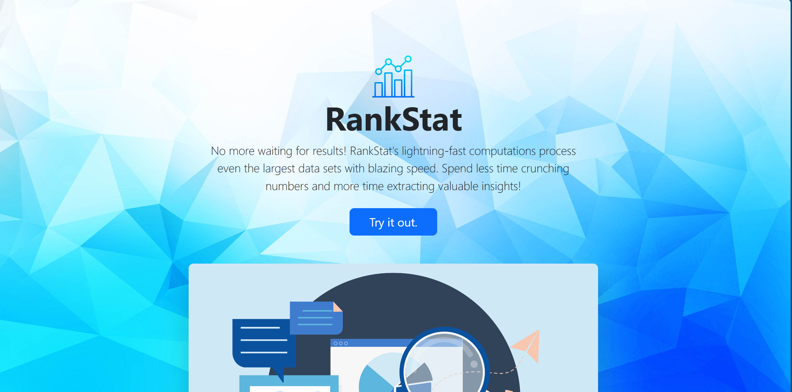
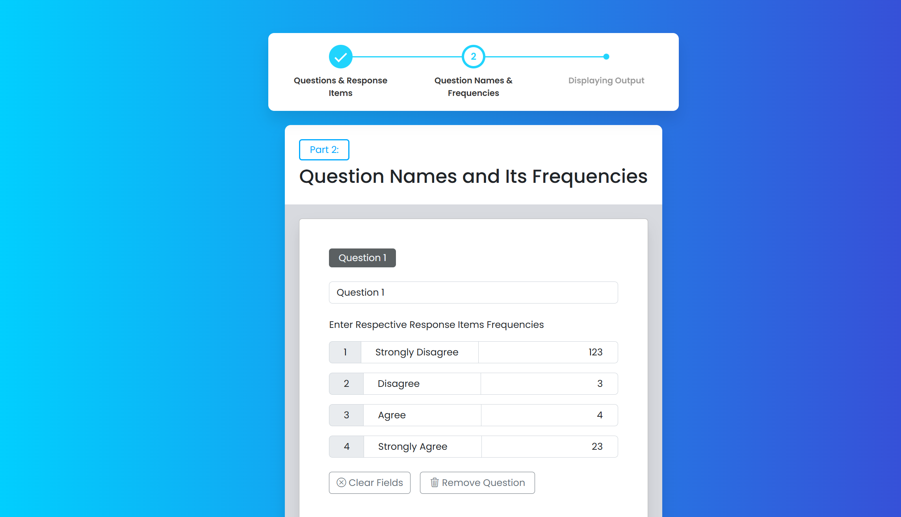
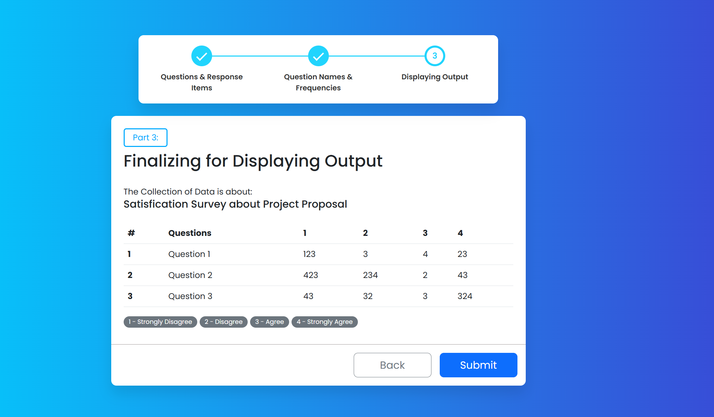
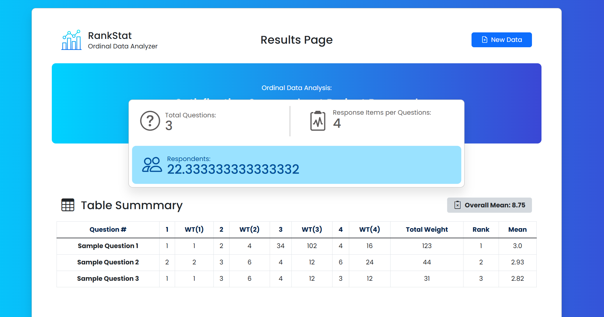

# 📊 RankStat

A simple and efficient tool that automates the calculation of statistics for surveys and research data.  
It allows users to input questions, response items, and their frequencies, then generates a complete statistical summary including weighted totals, ranking, and mean.

---

## 🚀 Features

### **1. Input Questions & Response Items**
- Add a survey question.
- Add multiple response items (e.g., Likert scale options).

### **2. Frequency Input**
- Enter the frequency for each response item.
- Automatically validates and organizes responses.

### **3. Automated Statistical Computation**
Automates computation for weighted statistics table.
### **4. Results Display**
- A result table summarizing all weighted totals.
- A detailed statistics section breaking down the data.

---

## 📷 Screenshots

---

## 🛠 Technologies Used
- HTML
- CSS
- JavaScript
- Flask
- Bootstrap
